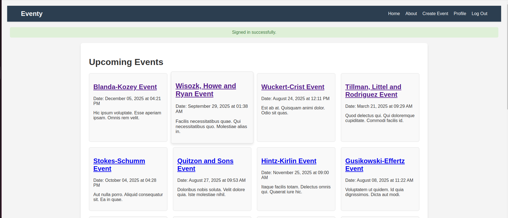

# Private Events Rails Application


## Project Description
This is a Private Events application where users can create and attend events. Users can sign up and log in using Devise authentication. Events can be created by users and other users can attend those events.

## Setup Instructions
1. Clone the repository:
    ```bash
    git clone git@github.com:fabortwell/private-members.git
    cd private-events
    ```

2. Install the required gems:
    ```bash
    bundle install
    ```

3. Set up the database:
    ```bash
    rails db:create
    rails db:migrate
    ```

4. Start the Rails server:
    ```bash
    rails server
    ```

5. Open your web browser and navigate to `http://localhost:3000` to see the application.

## Data Models
### User
- A User can create many events.
- A User can attend many events.

### Event
- An Event is created by a single User (creator).
- An Event can have many attendees (Users).

### Association Tables
- `Attendance` table (join table) to handle the many-to-many relationship between Users and Events.

## Steps to Implement
### Events and Users
1. Create and migrate the `Event` model without any foreign keys or validations.
    ```ruby
    rails generate model Event title:string description:text date:datetime
    rails db:migrate
    ```

2. Create the `EventsController` and add an `#index` action.
    ```ruby
    rails generate controller Events index
    ```

3. Create a corresponding view for the `#index` action and add a heading.
    ```erb
    <!-- app/views/events/index.html.erb -->
    <h1>All Events</h1>
    ```

4. Set up Devise for User authentication.
    ```ruby
    rails generate devise:install
    rails generate devise User
    rails db:migrate
    ```

5. Set the `root_path` to be the Event's index page.
    ```ruby
    # config/routes.rb
    root 'events#index'
    ```

6. Add association between the event creator (User) and the event.
    ```ruby
    # app/models/event.rb
    class Event < ApplicationRecord
        belongs_to :creator, class_name: 'User', foreign_key: 'user_id'
    end

    # app/models/user.rb
    class User < ApplicationRecord
        has_many :created_events, class_name: 'Event', foreign_key: 'user_id'
    end
    ```

7. Update the `EventsController` and routes to allow creating a new event.
    ```ruby
    # app/controllers/events_controller.rb
    def new
        @event = current_user.created_events.build
    end

    def create
        @event = current_user.created_events.build(event_params)
        if @event.save
            redirect_to @event
        else
            render 'new'
        end
    end

    private

    def event_params
        params.require(:event).permit(:title, :description, :date)
    end
    ```

8. Create a form for creating an event.
    ```erb
    <!-- app/views/events/new.html.erb -->
    <%= form_with model: @event, local: true do |form| %>
        <%= form.label :title %>
        <%= form.text_field :title %>

        <%= form.label :description %>
        <%= form.text_area :description %>

        <%= form.label :date %>
        <%= form.datetime_select :date %>

        <%= form.submit %>
    <% end %>
    ```

9. Display event details on the Event's show page.
    ```erb
    <!-- app/views/events/show.html.erb -->
    <h1><%= @event.title %></h1>
    <p><%= @event.description %></p>
    <p><%= @event.date %></p>
    ```

### Event Attendance
1. Add association between event attendee (User) and the event.
    ```ruby
    # app/models/attendance.rb
    class Attendance < ApplicationRecord
        belongs_to :attendee, class_name: 'User'
        belongs_to :attended_event, class_name: 'Event'
    end

    # app/models/user.rb
    class User < ApplicationRecord
        has_many :attendances, foreign_key: 'attendee_id'
        has_many :attended_events, through: :attendances
    end

    # app/models/event.rb
    class Event < ApplicationRecord
        has_many :attendances, foreign_key: 'attended_event_id'
        has_many :attendees, through: :attendances
    end
    ```

2. Create and migrate the `Attendance` model and necessary foreign keys.
    ```ruby
    rails generate model Attendance attendee:references attended_event:references
    rails db:migrate
    ```

3. Create a controller and corresponding routes for the `Attendance` model.
    ```ruby
    # config/routes.rb
    resources :attendances, only: [:create, :destroy]
    ```

4. Update the Event's show page to display a list of attendees.
    ```erb
    <!-- app/views/events/show.html.erb -->
    <h1><%= @event.title %></h1>
    <p><%= @event.description %></p>
    <p><%= @event.date %></p>

    <h2>Attendees</h2>
    <ul>
    <% @event.attendees.each do |attendee| %>
        <li><%= attendee.name %></li>
    <% end %>
    </ul>
    ```

5. Add to the User's show page a list of their attended events.
    ```erb
    <!-- app/views/users/show.html.erb -->
    <h1><%= @user.name %></h1>

    <h2>Created Events</h2>
    <ul>
    <% @user.created_events.each do |event| %>
        <li><%= event.title %></li>
    <% end %>
    </ul>

    <h2>Attended Events</h2>
    <ul>
    <% @user.attended_events.each do |event| %>
        <li><%= event.title %></li>
    <% end %>
    </ul>
    ```

6. Separate the list of attended events into past and upcoming events.
    ```erb
    <!-- app/views/users/show.html.erb -->
    <h2>Past Attended Events</h2>
    <ul>
    <% @user.attended_events.past.each do |event| %>
        <li><%= event.title %></li>
    <% end %>
    </ul>

    <h2>Upcoming Attended Events</h2>
    <ul>
    <% @user.attended_events.upcoming.each do |event| %>
        <li><%= event.title %></li>
    <% end %>
    </ul>
    ```

---
MIT License

Permission is hereby granted, free of charge, to any person obtaining a copy
of this software and associated documentation files (the "Software"), to deal
in the Software without restriction, including without limitation the rights
to use, copy, modify, merge, publish, distribute, sublicense, and/or sell
copies of the Software, and to permit persons to whom the Software is
furnished to do so, subject to the following conditions:

The above copyright notice and this permission notice shall be included in all
copies or substantial portions of the Software.

THE SOFTWARE IS PROVIDED "AS IS", WITHOUT WARRANTY OF ANY KIND, EXPRESS OR
IMPLIED, INCLUDING BUT NOT LIMITED TO THE WARRANTIES OF MERCHANTABILITY,
FITNESS FOR A PARTICULAR PURPOSE AND NONINFRINGEMENT. IN NO EVENT SHALL THE
AUTHORS OR COPYRIGHT HOLDERS BE LIABLE FOR ANY CLAIM, DAMAGES OR OTHER
LIABILITY, WHETHER IN AN ACTION OF CONTRACT, TORT OR OTHERWISE, ARISING FROM,
OUT OF OR IN CONNECTION WITH THE SOFTWARE OR THE USE OR OTHER DEALINGS IN THE
SOFTWARE.
